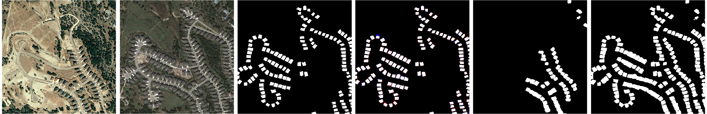

# FCCDN
This repo is the official implementation of ["FCCDN: Feature Constraint Network for VHR Image Change Detection."](https://arxiv.org/abs/2105.10860)
 
 

## Dependencies

> pytorch==1.7.1 
> albumentations==0.5.2
> numpy==1.19.2
> gdal==2.3.3

## TODO List
- [x] networks
- [x] loss
- [ ] augmentation
- [ ] train
- [x] test
- [ ] Getting started

## Datasets 
Users can find the datasets used in this publication in the following locations:  
LEVIR CD Dataset: https://justchenhao.github.io/LEVIR/  
WHU Dataset: http://gpcv.whu.edu.cn/data/building_dataset.html  

## Citation
If you find this work interesting in your research, please cite:

@article{chen2021fccdn,
  title={FCCDN: Feature Constraint Network for VHR Image Change Detection},
  author={Chen, Pan and Hong, Danfeng and Chen, Zhengchao and Yang, Xuan and Li, Baipeng and Zhang, Bing},
  journal={arXiv preprint arXiv:2105.10860},
  year={2021}
}